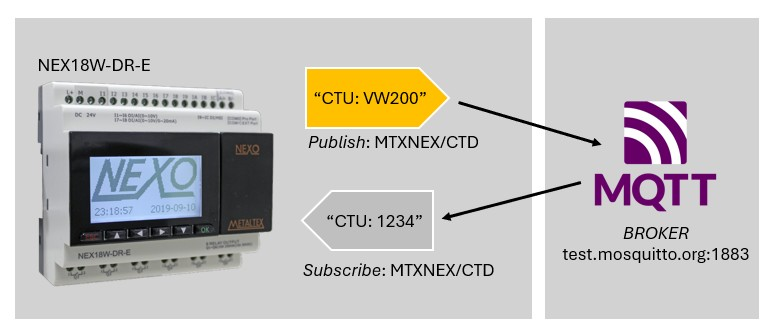
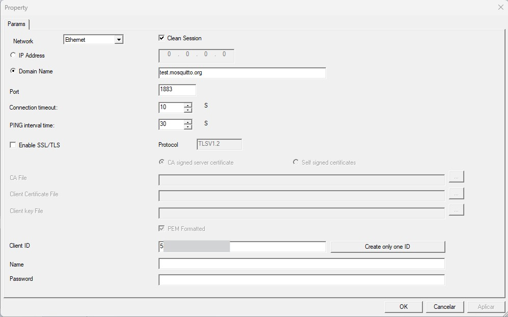
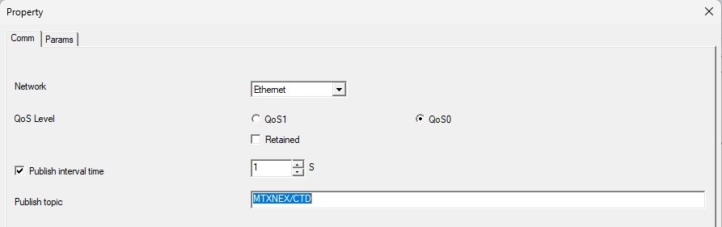
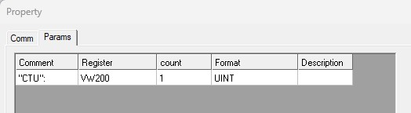
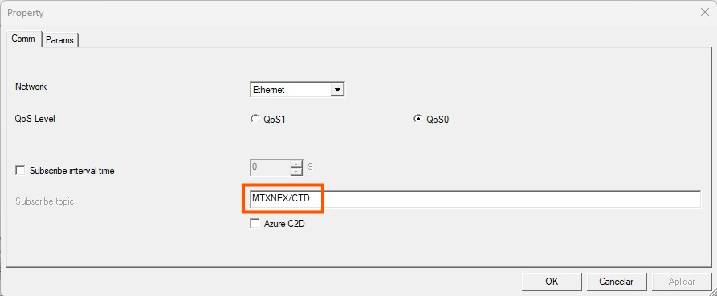
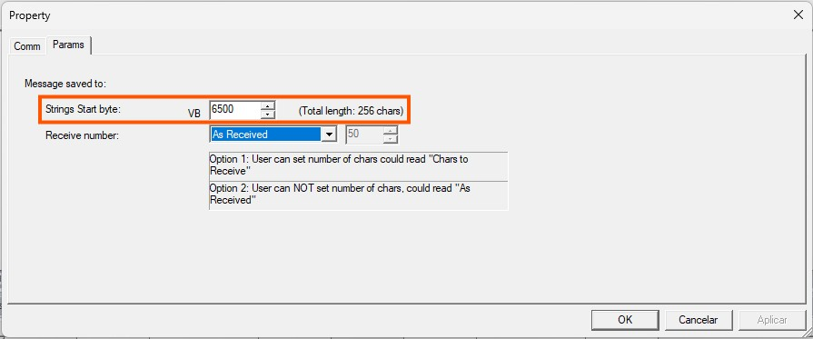

# Comunicação MQTT - Metaltex NEX18W
Comunicação MQTT com o CLP Metaltex NEX18W-RD-E.

## Hardware utilizado

**CLP**:   

> Metaltex **NEX18W-DR-E**:
> *   MINI CLP NEXO COM ETHERNET- 12 ENTRADAS (6EA + 2EA + 4HSC) / 6 SAÍDAS RELÉ - ALIMENTAÇÃO 24VCC*

**Cabo de programação**:   

> *NEX-C-PROG*

## Arquivos de projeto

Na tabela abaixo estão os arquivos utilizados no projeto:

| Arquivo | Descrição | Software / Versão |
|------|-----------|----------|
| IHM_NEX18W_MQTT.vcx | Design da IHM frontal | Nexo IHM Editor 1.2 |
| MQTT_PUB_SUB.vcw | Projeto ladder para CPU NEX18W-DR-E | NexoSoft V1.4 (8 Sep 2025) |

## Como funciona?

1. A cada 1s, o CLP incrementa o valor de um contador interno local;
2. O valor da variável do contador é publicada no broker MQTT - via método **PUBLISH (topico: MTXNEX/CTD)**;
3. O clp faz a leitura do tópico no broker MQTT - via método **SUBSCRIBE (tópico: MTXNEX/CTD)**;
4. O clp trata a resposta recebida do broker MQTT e exibe na IHM

## Etapa 1. Estabelecendo a conexão com o broker MQTT

Com o bloco de função **'MQTT_CONN'** (Instructions > FBD > MQTT_CONN) é realizada as configurações de comunicação com o broker mqtt, conforme exemplo abaixo:

> **Network:** Ethernet
> 
> **Clean Session:** marcar a opção para realizar corretamente a desconexão com o broker
> 
> **Domain name:** test.mosquitto.org
> 
> **Port:** 1883
> 
> **Connection timeout:** 10s
> 
> **Ping interval time:** 30s
> 
> **Create one only ID:** necessário clicar uma unica vez no botão para a geração de um identificador de cliente

#### Códigos de saída do bloco MQTT_CONN

`2: Conectando ao servidor de destino`

`3: O MQTT PING está enviando um pacote PING`

`5: Desconectando`

`20: Resolvendo nome de domínio`

`21: Resolução de nome de domínio bem-sucedida`

`22, 23, 24: Falha na resolução de nome de domínio`

`50: Falha na conexão`

`255: A conexão foi bem-sucedida`

## Etapa 2. Publicando (Publish) um tópico de mensagem no broker MQTT

Através do bloco de função **MQTT_PUB** (Instructions > FBD > MQTT_PUB) é realizada a publicação de uma mensagem no broker MQTT.

**Parâmetros configurados na aba COMM:**

> **COMM**
>
> **Network:** Ethernet
> 
> **QoS0:** Marcando essa opção a entrega é feita no máximo uma vez. Não há confirmação do broker, pode haver perda de mensagem.
> 
> **Retained:** Desmarcar essa opção. Quando ninguém se inscreve no tópico, então a mensagem será descartada (não retida) pelo servidor MQTT.
> 
> **Publish interval time:** 1s (intervalo de tempo de publicação, pode ser customizado conforme necessidade)
> 
> **Publish topic:** MTXNEX/CTD
>

**Parâmetros configurados na aba PARAMS:**

Vamos publicar a mensagem com o conteúdo da variável VW200: `"CTU":VW200`

> **PARAMS**
>
> **Comment:** "CTU":
> 
> **Register:** VW200
> 
> **Count:** 1
> 
> **Format:** UINT
> 
> **Description:**
>

## Etapa 3. Inscrição (Subscribe) em um tópico de mensagem no broker MQTT

Utilizando o bloco de função MQTT_SUB (Instructions > FBD > MQTT_SUB), conseguimos obter o conteúdo de um tópico específico do broker MQTT.

**Parâmetros configurados na aba COMM:**

> **COMM**
>
> **Network:** Ethernet
> 
> **QoS0:** Marcando essa opção a entrega é feita no máximo uma vez. Não há confirmação do broker, pode haver perda de mensagem.
> 
> **Subscribe interval time:** 1s, ou configurar conforme necessidade.
> 
> **Subscribe topic:** MTXNEX/CTD (configurado para receber o conteudo do topico MTXNEX/CTD)

**Parâmetros configurados na aba PARAMS:**

> **PARAMS**
>
> **String start byte:** VB6500 (byte no qual receberá a resposta, tamanho máximo de 256)
> 
> **Receive Number:** As received (a quantidade de byte recebidos é variável de acordo com o tamanho da mensagem)
>

## Etapa 4. Formatando a resposta recebida do broker MQTT

A mensagem é recebida do broker no formato string (um conjunto de letras e números):

> `CTU:123`

Utilizando o bloco de conversão **String to Double Integer**, é possível extrair somente a parte numérica da mensagem recebida:

> Antes: `"CTU":123`
> 
> Depois: `123`

**Configurações do bloco String to Double Integer**

> **IN:** VB6500 (byte que contém a resposta)
> 
> **INDX:** 6 (posição do texto no qual inicia-se somente a parte numérica)
>

## Resultado - Nexo Web integrado via MQTT

Observações:

> 1. Note que, com o cabo de rede desconectado, o valor recebido (subscribe) do broker é diferente do valor enviado (publish), caracterizando um evento de desconexão.
> 2. Uma vez o cabo de rede conectado, o CLP realiza a conexão automática com o broker, assim o valor recebido (subscribe) passa a ser igual ao valor enviado (publish).
